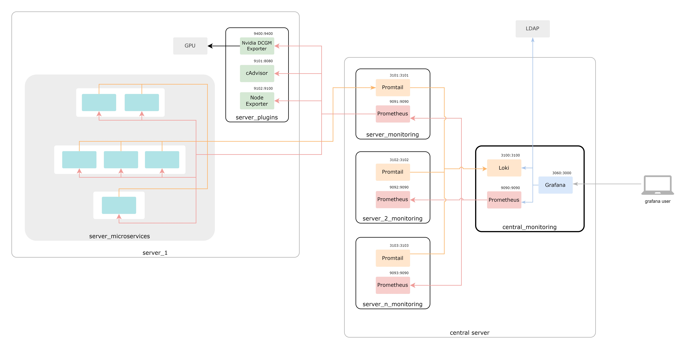

# Scalable Monitoring Architecture using the Grafana Stack

## Description
This repository provides a scalable architecture to deploy a monitoring system using the Grafana stack as a visualization platform, Prometheus for metric collection, Loki for log aggregation, and Promtail for log scraping.

## Architecture

## Repository Structure
- **/central-monitoring**: Contains the central structure where all our servers' monitoring is consolidated.
- **/server-monitoring**: Contains the structure to consolidate all metrics and logs from each individual server.
- **/plugins-server-monitoring**: Coming soon

Within each case, you will find the `/conf` folder:
- **/grafana**: Contains configuration files and dashboards for Grafana.
- **/prometheus**: Contains configuration files for Prometheus.
- **/loki**: Contains configuration files for Loki.
- **/promtail**: Contains configuration files for Promtail.

## Tools Used

### Grafana
Grafana is an open-source platform for data visualization and analysis. It allows creating interactive dashboards to monitor metrics and logs.

### Prometheus
Prometheus is an open-source monitoring and alerting system designed to collect metrics from systems and services.

### Loki
Loki is an open-source log aggregation system, built to be easily integrated with other monitoring tools like Prometheus and Grafana.

### Promtail
Promtail is a log scraping agent for Loki. It collects, indexes, and sends logs to a Loki server for storage and analysis.

## Contributions
Contributions are welcome. If you encounter any issues or have any improvements, please open an issue or submit a pull request.
